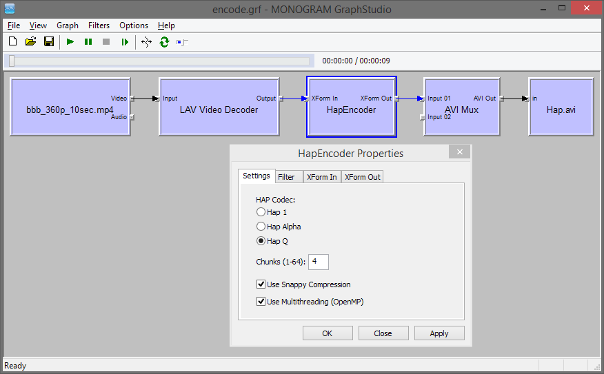

# HapEncoder
A simple DirectShow video encoder filter that encodes [HAP video](http://hap.video/) (Hap1, Hap Alpha, Hap Q).

For now it only supports RGB32 as input. It has a config dialog that allows to configure various settings:
* The HAP flavor (Hap1, Hap Alpha, Hap Q)
* Chunks (1-64, default=1)
* Snappy compression (default=FALSE)
* Multithreading support via OpenMP (default=TRUE)

Note: while it is possible to load the filter file only locally, i.e. without global registration in the system, the config dialog is only available if the filter was first globally registered (just run batch script "_register_run_as_admin.bat" in the "release" folder to do this).

Encoded videos are compatible with various decoders/players, e.g. [FFmpeg/FFplay](https://github.com/FFmpeg/FFmpeg), [Renderheads VfW codec](https://github.com/Vidvox/hap-directshow), [HapDecoder](https://github.com/59de44955ebd/HapDecoder) etc.

The filter is a standard DirectShow video filter, and when globally registered, should be available in any application based on DirectShow. As an example, a small DirectShow console app called "DScmd" is included in the "release" folder. Just run batch script "demo_transcode_to_Hap.bat" to transcode a small H.264 MP4 video to a HAP AVI.

*Screenshots*

HapEncoder in GraphStudio, transcoding "bbb_360p_10sec.mp4" to Hap Q (with Snappy compression and 4 chunks):

